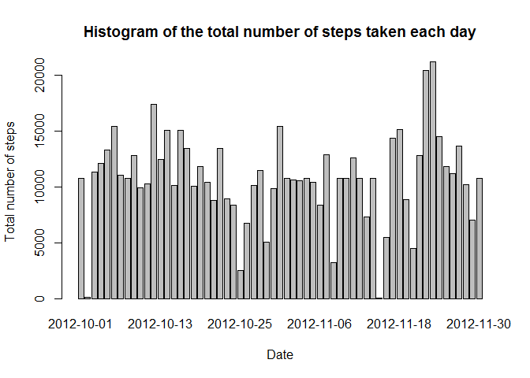

# Reproducible Research: Peer Assessment 1


## Loading and preprocessing the data

Download the file **activity.zip** from the repository into the current directory and unzip it.

```r
library(dplyr)
library(lattice)
df <- read.csv("activity.csv")
```

## What is mean total number of steps taken per day?

1. Calculating the total number of steps taken per day.

```r
totalStepsByDate1 <- tapply(df$steps, df$date, FUN = sum, na.rm=TRUE)
```

2. Histogram of the total number of steps taken each day.

```r
barplot(totalStepsByDate1, xlab="Date", ylab="Total number of steps", main="Total number of steps taken each day")
```

 

3. The mean and median of the total number of steps taken per day.

```r
meanMedianByDate1 <- df %>% group_by(date) %>% summarize(mean = mean(steps, na.rm=TRUE), median = median(steps, na.rm=TRUE))
as.data.frame(meanMedianByDate1)
```

```
##          date       mean median
## 1  2012-10-01        NaN     NA
## 2  2012-10-02  0.4375000      0
## 3  2012-10-03 39.4166667      0
## 4  2012-10-04 42.0694444      0
## 5  2012-10-05 46.1597222      0
## 6  2012-10-06 53.5416667      0
## 7  2012-10-07 38.2465278      0
## 8  2012-10-08        NaN     NA
## 9  2012-10-09 44.4826389      0
## 10 2012-10-10 34.3750000      0
## 11 2012-10-11 35.7777778      0
## 12 2012-10-12 60.3541667      0
## 13 2012-10-13 43.1458333      0
## 14 2012-10-14 52.4236111      0
## 15 2012-10-15 35.2048611      0
## 16 2012-10-16 52.3750000      0
## 17 2012-10-17 46.7083333      0
## 18 2012-10-18 34.9166667      0
## 19 2012-10-19 41.0729167      0
## 20 2012-10-20 36.0937500      0
## 21 2012-10-21 30.6284722      0
## 22 2012-10-22 46.7361111      0
## 23 2012-10-23 30.9652778      0
## 24 2012-10-24 29.0104167      0
## 25 2012-10-25  8.6527778      0
## 26 2012-10-26 23.5347222      0
## 27 2012-10-27 35.1354167      0
## 28 2012-10-28 39.7847222      0
## 29 2012-10-29 17.4236111      0
## 30 2012-10-30 34.0937500      0
## 31 2012-10-31 53.5208333      0
## 32 2012-11-01        NaN     NA
## 33 2012-11-02 36.8055556      0
## 34 2012-11-03 36.7048611      0
## 35 2012-11-04        NaN     NA
## 36 2012-11-05 36.2465278      0
## 37 2012-11-06 28.9375000      0
## 38 2012-11-07 44.7326389      0
## 39 2012-11-08 11.1770833      0
## 40 2012-11-09        NaN     NA
## 41 2012-11-10        NaN     NA
## 42 2012-11-11 43.7777778      0
## 43 2012-11-12 37.3784722      0
## 44 2012-11-13 25.4722222      0
## 45 2012-11-14        NaN     NA
## 46 2012-11-15  0.1423611      0
## 47 2012-11-16 18.8923611      0
## 48 2012-11-17 49.7881944      0
## 49 2012-11-18 52.4652778      0
## 50 2012-11-19 30.6979167      0
## 51 2012-11-20 15.5277778      0
## 52 2012-11-21 44.3993056      0
## 53 2012-11-22 70.9270833      0
## 54 2012-11-23 73.5902778      0
## 55 2012-11-24 50.2708333      0
## 56 2012-11-25 41.0902778      0
## 57 2012-11-26 38.7569444      0
## 58 2012-11-27 47.3819444      0
## 59 2012-11-28 35.3576389      0
## 60 2012-11-29 24.4687500      0
## 61 2012-11-30        NaN     NA
```

## What is the average daily activity pattern?

1. A time series plot of the 5-minute interval (x-axis) and the average number of steps taken, averaged across all days (y-axis).

```r
avgStepsByInterval1 <- df %>% group_by(interval) %>% summarize(averageSteps = mean(steps, na.rm=TRUE))
with(avgStepsByInterval1,plot(strptime(sprintf("%04d", interval), format="%H%M"),averageSteps,type="l", xlab="Interval", ylab="Average number of steps taken", main="Average daily activity pattern"))
```

 

2. The 5-minute interval, on average across all the days in the dataset, which contains the maximum number of steps.

```r
as.data.frame(avgStepsByInterval1[avgStepsByInterval1$averageSteps==max(avgStepsByInterval1$averageSteps),])[,1]
```

```
## [1] 835
```

## Imputing missing values

1. Total number of missing values in the dataset.

```r
nrow(df[is.na(df$steps),])
```

```
## [1] 2304
```

2. Strategy for filling in all of the missing values in the dataset.
- Averaging the steps by date we get some dates with no value.

```r
as.data.frame(meanMedianByDate1[is.na(meanMedianByDate1$mean),])
```

```
##         date mean median
## 1 2012-10-01  NaN     NA
## 2 2012-10-08  NaN     NA
## 3 2012-11-01  NaN     NA
## 4 2012-11-04  NaN     NA
## 5 2012-11-09  NaN     NA
## 6 2012-11-10  NaN     NA
## 7 2012-11-14  NaN     NA
## 8 2012-11-30  NaN     NA
```
- For instance let's look at steps taken at all interval on **2013-10-08**. By taking the unique from the output we can confirm that none of the intervals have steps.

```r
unique(df[df$date=="2012-10-08","steps"])
```

```
## [1] NA
```
- Averaging the steps by interval is a better option as we get all non-NA values.

```r
unique(is.na(avgStepsByInterval1$averageSteps))
```

```
## [1] FALSE
```
- Now let's take the average steps by each interval and keep it in a new variable **avgStepsByInterval2**. 

```r
avgStepsByInterval2 <- tapply(df$steps, df$interval, FUN = mean, na.rm=TRUE)
```

3. Create a new dataset that is equal to the original dataset but with the missing data filled in. Store the transformed data frame in a new variable **tdf**. Please note that average steps by each interval can be decimal values and hence they have been rounded.

```r
tdf <- df
tdf$steps <- ifelse(is.na(tdf$steps),round(avgStepsByInterval2[as.character(tdf$interval)],digits=0),tdf$steps)
```

4. Histogram of the total number of steps taken each day.

```r
totalStepsByDate2 <- tapply(tdf$steps, tdf$date, FUN = sum)
barplot(totalStepsByDate2, xlab="Date", ylab="Total number of steps", main="Histogram of the total number of steps taken each day")
```

 

- Mean and median total number of steps taken per day. These values now have all non-NA values and hence differ from the estimates from the first part of the assignment.

```r
meanMedianByDate2 <- tdf %>% group_by(date) %>% summarize(mean = mean(steps, na.rm=TRUE), median = median(steps, na.rm=TRUE))
as.data.frame(meanMedianByDate2)
```

```
##          date       mean median
## 1  2012-10-01 37.3680556   34.5
## 2  2012-10-02  0.4375000    0.0
## 3  2012-10-03 39.4166667    0.0
## 4  2012-10-04 42.0694444    0.0
## 5  2012-10-05 46.1597222    0.0
## 6  2012-10-06 53.5416667    0.0
## 7  2012-10-07 38.2465278    0.0
## 8  2012-10-08 37.3680556   34.5
## 9  2012-10-09 44.4826389    0.0
## 10 2012-10-10 34.3750000    0.0
## 11 2012-10-11 35.7777778    0.0
## 12 2012-10-12 60.3541667    0.0
## 13 2012-10-13 43.1458333    0.0
## 14 2012-10-14 52.4236111    0.0
## 15 2012-10-15 35.2048611    0.0
## 16 2012-10-16 52.3750000    0.0
## 17 2012-10-17 46.7083333    0.0
## 18 2012-10-18 34.9166667    0.0
## 19 2012-10-19 41.0729167    0.0
## 20 2012-10-20 36.0937500    0.0
## 21 2012-10-21 30.6284722    0.0
## 22 2012-10-22 46.7361111    0.0
## 23 2012-10-23 30.9652778    0.0
## 24 2012-10-24 29.0104167    0.0
## 25 2012-10-25  8.6527778    0.0
## 26 2012-10-26 23.5347222    0.0
## 27 2012-10-27 35.1354167    0.0
## 28 2012-10-28 39.7847222    0.0
## 29 2012-10-29 17.4236111    0.0
## 30 2012-10-30 34.0937500    0.0
## 31 2012-10-31 53.5208333    0.0
## 32 2012-11-01 37.3680556   34.5
## 33 2012-11-02 36.8055556    0.0
## 34 2012-11-03 36.7048611    0.0
## 35 2012-11-04 37.3680556   34.5
## 36 2012-11-05 36.2465278    0.0
## 37 2012-11-06 28.9375000    0.0
## 38 2012-11-07 44.7326389    0.0
## 39 2012-11-08 11.1770833    0.0
## 40 2012-11-09 37.3680556   34.5
## 41 2012-11-10 37.3680556   34.5
## 42 2012-11-11 43.7777778    0.0
## 43 2012-11-12 37.3784722    0.0
## 44 2012-11-13 25.4722222    0.0
## 45 2012-11-14 37.3680556   34.5
## 46 2012-11-15  0.1423611    0.0
## 47 2012-11-16 18.8923611    0.0
## 48 2012-11-17 49.7881944    0.0
## 49 2012-11-18 52.4652778    0.0
## 50 2012-11-19 30.6979167    0.0
## 51 2012-11-20 15.5277778    0.0
## 52 2012-11-21 44.3993056    0.0
## 53 2012-11-22 70.9270833    0.0
## 54 2012-11-23 73.5902778    0.0
## 55 2012-11-24 50.2708333    0.0
## 56 2012-11-25 41.0902778    0.0
## 57 2012-11-26 38.7569444    0.0
## 58 2012-11-27 47.3819444    0.0
## 59 2012-11-28 35.3576389    0.0
## 60 2012-11-29 24.4687500    0.0
## 61 2012-11-30 37.3680556   34.5
```
- The impact of imputing missing data on the estimates of the total daily number of steps is that now we have non-zero total number of steps each day which we earlier use to have.

```r
NROW(totalStepsByDate2[totalStepsByDate2==0])
```

```
## [1] 0
```

```r
NROW(totalStepsByDate1[totalStepsByDate1==0])
```

```
## [1] 8
```

## Are there differences in activity patterns between weekdays and weekends?

1. Create a new factor variable **type** in the dataset with two levels - "weekday" and "weekend" indicating whether a given date is a weekday or weekend day.

```r
tdf$date <- as.Date(tdf$date) 
tdf$type <- as.factor(ifelse(weekdays(tdf$date) %in% c("Saturday","Sunday"),"weekend","weekday"))
```

2. Panel plot containing a time series plot of the 5-minute interval (x-axis) and the average number of steps taken, averaged across all weekday days or weekend days (y-axis)

```r
avgStepsByIntervalWeekdays <- tdf %>% group_by(interval,type) %>% summarize(averageSteps = mean(steps, na.rm=TRUE))
xyplot(avgStepsByIntervalWeekdays$averageSteps ~ avgStepsByIntervalWeekdays$interval | avgStepsByIntervalWeekdays$type, layout=c(1,2), type="l", xlab="Interval", ylab="Number of steps")
```

 
